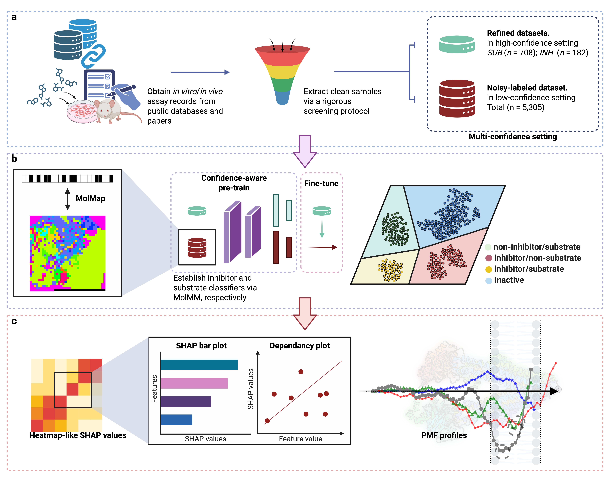

## MolMM-PMF

MolMM-PMF is an integrated computational framework for predicting substrates and inhibitors (allocrites) of the ABCB1 (P-glycoprotein) transporter. The framework combines meta-learning, multi-task learning, and confidence-aware transfer learning, and incorporates explainable AI (SHAP) and coarse-grained molecular dynamics (umbrella sampling) to provide mechanistic insights into allocrite recognition and inhibition. 

This repository provides: 

* Scripts for dataset curation and preprocessing 

* The MolMM model implementation (benchmark and ablation study models )
* Code for feature embeddings via MolMM model
* Code for SHAP-based molecular feature interpretation (“Smaps” and "tree plots") 


### Workflow for MolMM-PMF

---




### The workflow for dataset curation and preprocessing

---


* Refined datasets
  * [Establishing *in vitro* inhibitor dataset](https://github.com/PatrickSu1101/MolMM/tree/main/MolMM/csv/data_inh_refine/vitro.ipynb)
  * [Establishing *in vivo* inhibitor dataset](https://github.com/PatrickSu1101/MolMM/tree/main/MolMM/csv/data_inh_refine/vivo.ipynb)
  * [Establishing *in vitro* substrate dataset](https://github.com/PatrickSu1101/MolMM/tree/main/MolMM/csv/data_sub_refine/vitro.ipynb)
* Noisy-labeled dataset
  * [Establishing noisy-labeled substrate and inhibitor datasets](https://github.com/PatrickSu1101/MolMM/tree/main/MolMM/csv/data_classes/vitro.ipynb)


### The workflow for MolMM framework

---


Training and validating MolMM model (benchmark and ablation study models), and [predictive performance can be found in 201_performance.ipynb](https://github.com/PatrickSu1101/MolMM/tree/main/201_performance.ipynb):

``` bash
./000_run.sh
```


### SHAP-based molecular feature interpretation

---
1. Obtain the MolMap, Molecular descriptor information [101_molinfo.ipynb](https://github.com/PatrickSu1101/MolMM/blob/main/101_molinfo.ipynb).

2. Run [203_SHAP.ipynb](https://github.com/PatrickSu1101/MolMM/blob/main/203_SHAP.ipynb) to establish the SHAP-based molecular feature interpretation.


## Installation
---
If you want to rebuild the data, install the [MolMap](https://github.com/shenwanxiang/bidd-molmap/blob/master/) and run the script [data_preparing.py](https://github.com/PatrickSu1101/MolMM/blob/main/MolMM/data_preparing.py).

For runing the model training and validation, you need to install the [Pytorch lightening](https://lightning.ai/docs/pytorch/stable/):


```bash
pip install lightning
```


## Mol Performances

---

### Comparison study

| Models         | SUB AUC (%)      | SUB ACC (%)      | INH AUC (%)      | INH ACC (%)      |
| -------------- | ---------------- | ---------------- | ---------------- | ---------------- |
| Meta PTM       | 80.37 (2.23)     | 73.81 (4.35)     | 78.45 (5.63)     | 70.25 (4.89)     |
| Multi-task PTM | 79.87 (3.34)     | 73.10 (3.15)     | 79.14 (7.73)     | 71.41 (5.85)     |
| Vanilla PTM    | 76.47 (1.56)     | 70.53 (1.77)     | 79.16 (9.41)     | 72.71 (8.40)     |
| CNN w/o PTM    | 81.83 (2.15)     | 74.67 (4.45)     | 78.76 (2.87)     | 71.46 (3.82)     |
| MLP w/o PTM    | 75.47 (2.29)     | 71.67 (2.81)     | 75.31 (3.26)     | 68.43 (5.86)     |
| **MolMM**      | **81.26 (3.13)** | **74.67 (2.46)** | **83.33 (5.01)** | **76.27 (7.01)** |

------

### Ablation study

**Experiment(1): Feature encoders**

| Models           | SUB AUC (%)  | SUB ACC (%)  | INH AUC (%)  | INH ACC (%)  |
| ---------------- | ------------ | ------------ | ------------ | ------------ |
| MLP (MolMM)      | 74.91 (2.86) | 73.24 (3.21) | 83.49 (2.91) | 73.80 (1.38) |
| MLP (Supervised) | 75.47 (2.29) | 71.67 (2.81) | 75.31 (3.26) | 68.43 (5.86) |
| CNN (Supervised) | 81.83 (2.15) | 74.67 (4.45) | 78.76 (2.87) | 71.46 (3.82) |
| CNN (MolMM)      | 81.26 (3.13) | 74.67 (2.46) | 83.33 (5.01) | 76.27 (7.01) |

------

**Experiment(2): L task**

| Models         | SUB AUC (%)  | SUB ACC (%)  | INH AUC (%)  | INH ACC (%)  |
| -------------- | ------------ | ------------ | ------------ | ------------ |
| Multi-task PTM | 79.87 (3.34) | 73.10 (3.15) | 79.14 (7.73) | 71.41 (5.85) |
| MolMM          | 81.26 (3.13) | 74.67 (2.46) | 83.33 (5.01) | 76.27 (7.01) |

------

**Experiment(3): H task**

| Models      | SUB AUC (%)  | SUB ACC (%)  | INH AUC (%)  | INH ACC (%)  |
| ----------- | ------------ | ------------ | ------------ | ------------ |
| Meta PTM    | 80.37 (2.23) | 73.81 (4.35) | 78.45 (5.63) | 70.25 (4.89) |
| MolMM w/o H | 80.47 (1.63) | 74.53 (2.48) | 78.89 (3.20) | 69.66 (3.26) |
| MolMM       | 81.26 (3.13) | 74.67 (2.46) | 83.33 (5.01) | 76.27 (7.01) |

------

**Experiment(4): Hierarchical-confidence settings**

| Models          | SUB AUC (%)  | SUB ACC (%)  | INH AUC (%)  | INH ACC (%)  |
| --------------- | ------------ | ------------ | ------------ | ------------ |
| Mixed           | 76.92 (3.47) | 72.38 (3.47) | 77.20 (9.76) | 72.03 (7.32) |
| MolMM (inverse) | 78.82 (2.91) | 71.96 (2.05) | 77.61 (3.89) | 70.27 (3.51) |
| Multi-task PTM  | 79.87 (3.34) | 73.10 (3.15) | 79.14 (7.73) | 71.41 (5.85) |
| MolMM           | 81.26 (3.13) | 74.67 (2.46) | 83.33 (5.01) | 76.27 (7.01) |
